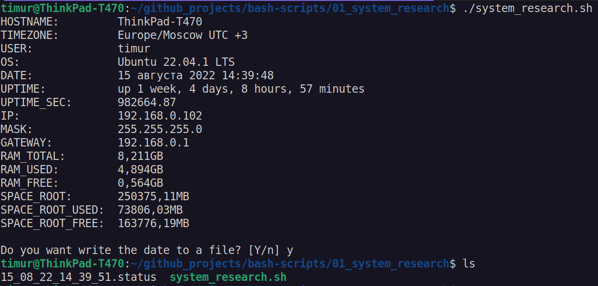
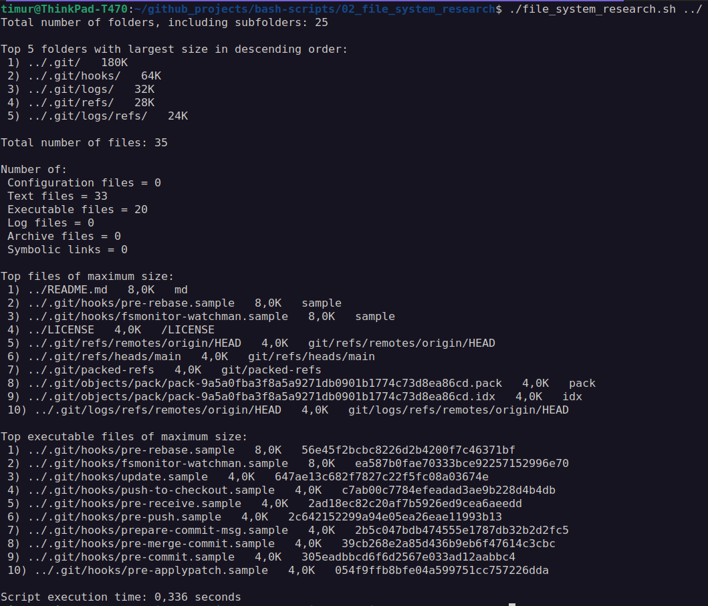
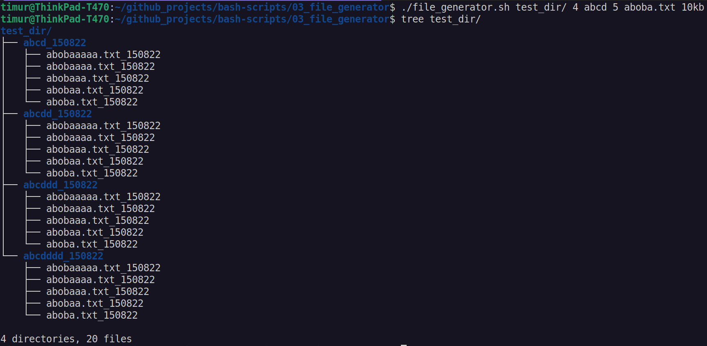
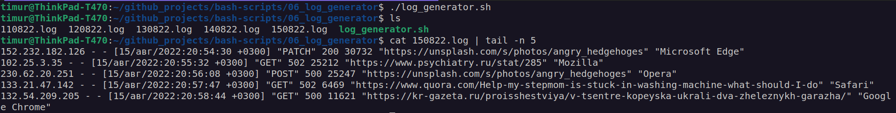
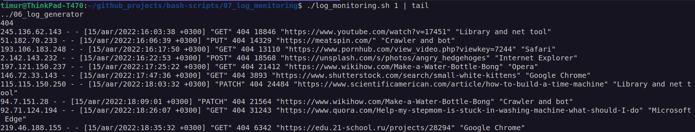

# Linux basic bash scripting and system research.

## 1. System research

The script output the following information:

**HOSTNAME** = _network name_  
**TIMEZONE** = _time zone as: **America/New_York UTC -5**_  
**USER** = _current user who ran the script_  
**OS** = _type and version of operating system_  
**DATE** = _current time as: **15 Aug 2022 12:24:36**_  
**UPTIME** = _system uptime_  
**UPTIME_SEC** = _system uptime in seconds_  
**IP** = _ip address of the machine (network interface must be changed in script manually)_  
**MASK** = _network mask as: **xxx.xxx.xxx.xxx**_.  
**GATEWAY** = _default gateway ip_  
**RAM_TOTAL** = _main memory size in GB with an accuracy of three decimal places as: **3.125 GB**_  
**RAM_USED** = _used memory size in GB with an accuracy of three decimal places_  
**RAM_FREE** = _free memory size in GB, with an accuracy of three decimal places_  
**SPACE_ROOT** = _root partition size in MB, with an accuracy of two decimal places, as **254.25 MB**_  
**SPACE_ROOT_USED** = _size of used space of the root partition in MB, with an accuracy of two decimal places_  
**SPACE_ROOT_FREE** = _size of free space of the root partition in MB, with an accuracy of two decimal places_

After outputting the values, script will suggest writing the data to a file (ask the user to answer **Y/N**). 
Responses **Y** and **y** are considered positive, all others - negative.

If the user agrees, script creates a file in the current directory containing the information that had been outputted.
The file name looks like: **DD_MM_YY_HH_MM_SS.status** (The time in the file name indicate when the data was saved).

## 2. File system research

The script is run with a single parameter.  
The parameter is an absolute or relative path to a directory. The parameter must end with '/', for example:  
`script05.sh /var/log/`

The script output the following information about the directory specified in the parameter:
- Total number of folders, including subfolders
- Top 5 folders with largest size in descending order (path and size)
- Total number of files
- Number of configuration files (with .conf extension), text files, executable files, log files (files with .log extension), archives, symbolic links
- Top 10 files with largest size in descending order (path, size and type)
- Top 10 executable files with largest size in descending order (path, size and hash)
- Execution time of the script

The script output the following information:

```
Total number of folders (including all nested ones) = 6  
TOP 5 folders of maximum size arranged in descending order (path and size):  
1 - /var/log/one/, 100 GB  
2 - /var/log/two/, 100 MB  
etc up to 5
Total number of files = 30
Number of:  
Configuration files (with the .conf extension) = 1 
Text files = 10  
Executable files = 5
Log files (with the extension .log) = 2  
Archive files = 3  
Symbolic links = 4  
TOP 10 files of maximum size arranged in descending order (path, size and type):  
1 - /var/log/one/one.exe, 10 GB, exe  
2 - /var/log/two/two.log, 10 MB, log  
etc up to 10  
TOP 10 executable files of the maximum size arranged in descending order (path, size and MD5 hash of file)  
1 - /var/log/one/one.exe, 10 GB, 3abb17b66815bc7946cefe727737d295  
2 - /var/log/two/two.exe, 9 MB, 53c8fdfcbb60cf8e1a1ee90601cc8fe2  
etc up to 10  
Script execution time (in seconds) = 1.5
```

## 3. File generator

The script is run with 6 parameters. An example of running a script: \
`main.sh /opt/test 4 az 5 az.az 3kb`

**Parameter 1** is the absolute path. \
**Parameter 2** is the number of subfolders. \
**Parameter 3** is a list of English alphabet letters used in folder names (no more than 7 characters). \
**Parameter 4** is the number of files in each created folder. \
**Parameter 5** - the list of English alphabet letters used in the file name and extension (no more than 7 characters for the name, no more than 3 characters for the extension). \
**Parameter 6** - file size (in kilobytes, but not more than 100).

When the script runs in the location specified in parameter 1, the folders and files should be created in them with the appropriate names and sizes. The script stop running if there is 1GB of free space left on the file system (in the / partition).

Script makes a log file with data on all created folders and files (full path, creation date, file size).

## 4. File system clogging

The script is run with 3 parameters. An example of running a script: \
`main.sh az az.az 3Mb`

**Parameter 1** is a list of English alphabet letters used in folder names (no more than 7 characters). \
**Parameter 2** the list of English alphabet letters used in the file name and extension (no more than 7 characters for the name, no more than 3 characters for the extension). \
**Parameter 3** - is the file size (in Megabytes, but not more than 100).

When running the script, file folders created in different (any, except paths containing **bin** or **sbin**) locations on the file system.
The number of subfolders is a random number up to 100. The number of files in each folder is a random number up to 200 (different for each folder). The script stop running when there is 1GB of free space left on the file system (in the / partition).

Script makes a log file with data on all created folders and files (full path, creation date, file size).

At the end, script display the start time, end time and total running time of the script. Log file will be completed with this data.


## 5. Cleaning the file system

The script is run with 1 parameter. The script is able to clear the system from the folders and files created in by previous script in 3 ways:

1. By log file
2. By creation date and time
3. By name mask (i.e. characters, underlining and date).

The cleaning method is set as a parameter with a value of 1, 2 or 3 when you run the script.

*When deleting by date and time of creation, the user enters the start and end times up to the minute. All files created within the specified time interval will be deleted.*

## 6. Log generator

Bash script that generates 5 **nginx** log files in *combined* format. Each log should contain information for 1 day.

A random number between 100 and 1000 entries generated per day.
For each entry there will be randomly generated the following:

1. IP (any correct one, i.e. no ip such as 999.111.777.777)
2. Response codes (200, 201, 400, 401, 403, 404, 500, 501, 502, 503)
3. methods (GET, POST, PUT, PATCH, DELETE)
4. Dates (within a specified log day, should be in ascending order)
5. Agent request URL
6. Agents (Mozilla, Google Chrome, Opera, Safari, Internet Explorer, Microsoft Edge, Crawler and bot, Library and net tool)

## 7. Log Monitoring

Bash script to parse **nginx** logs via **awk**.
The script is run with 1 parameter, which has a value of 1, 2, 3 or 4.

Depending on the value of the parameter, output the following:

1. All entries sorted by response code
2. All unique IPs found in the entries
3. All requests with errors (response code - 4xx or 5xxx)
4. All unique IPs found among the erroneous requests

## Screenshots





